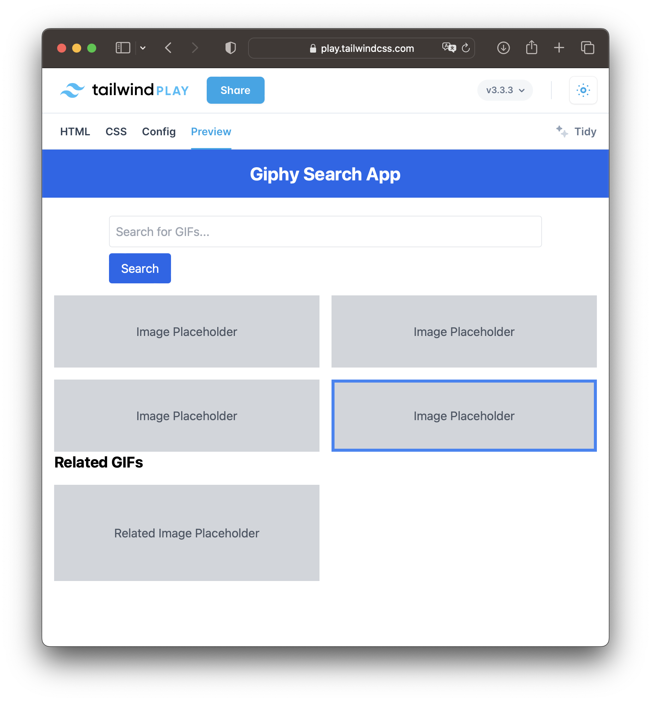

# TO DO - WIP

- [x] add assessment description
- [x] add project description
- [x] sketch some layout 
- [ ] test Giphy API
- [ ] ...
- [ ] document data flow
- [ ] add next steps

# Giphyx

A simple app that allows users to search the API and displays gifs returned from the API.

Features:

* Search functionality: Users should be able to search for gifs.
* Related gifs feature: When a user clicks on an individual gif, they should be presented with related gifs.

## Layout & Design & Big picture - WIP

[html](./layout.html)

* The `App.vue` component manages the main layout, search functionality, and fetching of related GIFs.
* The `SearchComponent.vue` allows users to input a search query and emits an event when the search button is clicked.
* The `GifListComponent.vue` displays a list of GIFs. Could be the searched or related GIFs.
* The `GifComponent.vue` displays a GIF. When a GIF is clicked, it's highlighted, and an event is emitted to fetch related GIFs.

